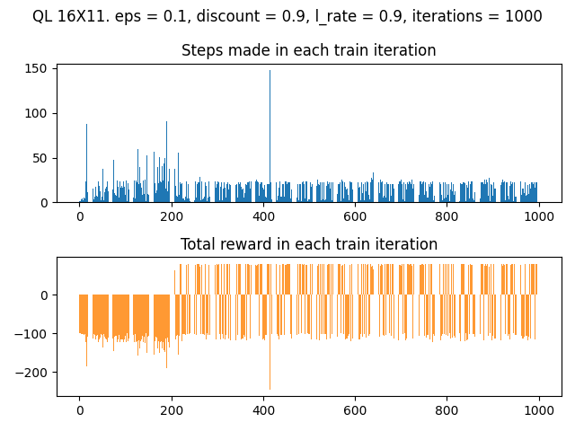
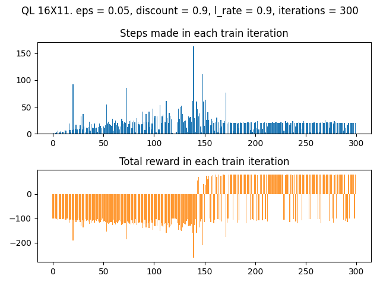
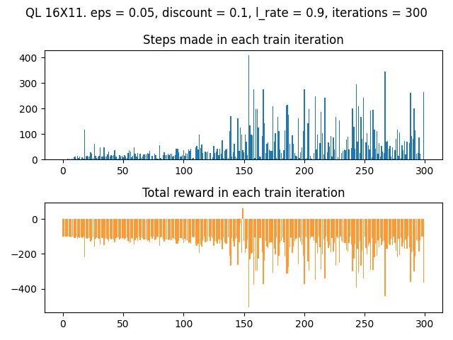
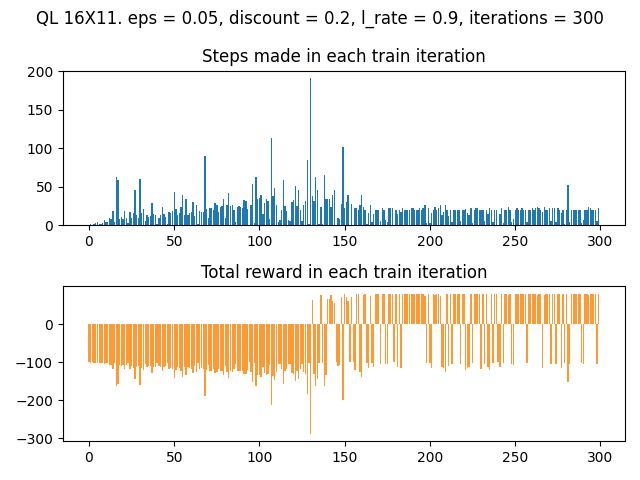
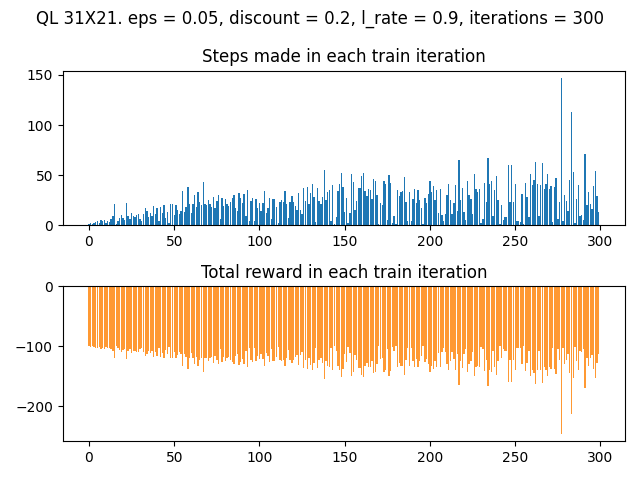

## Uczenie się ze wzmocnieniem: algorytm Q-Learning

_Stanislau Stankevich_

Program potrafi wyliczyć ścieżkę od 'S' do 'F' dla labiryntu o dowolnym rozmiarze.

Program pozwala na konfigurację parametrów:

* `eps` (ε) - parametr zachłania algorytmu. Im jest większy tym większe prawdopodobnieństwo że agent wybierze losową akcję zamiast najbardziej korzystnej. (ε <= 1)
* `discount` - parametr, odpowiadający za horyzont czasowy. Im discount jest większy, tym więcej agent patrzy na przyszłe kary ewoluując akcję. (discount <= 1)
* `rate` - współczynnik uczenia się. Im większy tym większa zmiana Q po każdej iteracji. (rate < 1)
* `n_iterations` - liczba prób dojść do celu, ucząc się i poprawiając Q.

### Prezentacja działania

Przykładowa mapa o rozmiarze 16x11, znajdująca się w pliku o nazwie [maze2.txt](maze2.txt):

```
...#############
......#..F..#..#
#..#..####..#..#
#..#........#..#
####..####..#..#
#........#.....#
#..#..####..####
#..#.....#.....#
####..##########
#..........S....
#############...
```

Parametry:

```
eps = 0.1
discount = 0.9
rate = 0.9
n_iterations = 1000
```

Żeby lepiej rozróżniać sukcesy, małe i duże porażki przyjmiemy następujące kary:

* wolna kratka -1
* ściana -100
* cel 100

Wynik działania:
```
...#############
......#..F←.#..#
#..#..####↑.#..#
#..#.→→→→→↑.#..#
####.↑####..#..#
#....↑...#.....#
#..#.↑####..####
#..#.↑...#.....#
####.↑##########
#....↑←←←←←S....
#############...
Plan:
(9, 11) -> (9, 10) -> (9, 9) -> (9, 8) -> (9, 7) -> (9, 6) -> (9, 5)
-> (8, 5) -> (7, 5) -> (6, 5) -> (5, 5) -> (4, 5) -> (3, 5) -> (3, 6) 
-> (3, 7) -> (3, 8) -> (3, 9) -> (3, 10) -> (2, 10) -> (1, 10) -> (1, 9)

```

Zależność ilości kroków którą zdąży zrobić agent za nim trafi do stanu terminalnego (ściana albo cel) oraz łącza kara za te kroki:



### Wnioski z powyższego przykładu:

Jak widać na samym początku (pierwsze ~10 iteracji) 
uczenia agent robi najmniej kroków, zanim zderzy
się ze ścianą. Ma to sens, bo na początku uczenia
agent jest najmniej "świadomy" środowiska (wszystkie Q = 0). 
Około 400 iteracji widać szpilkę na górnym wykresie oraz odpowiadającą
jej ujemną szpilkę na dolnym wykresie. Oznacza to że około 400 iteracji 
agent potrafił zrobić bardzo dużo króków po wolnych kratkach, ale w końcu
jednak zderzył się ze ścianą. Po ~210 iteracjach na dolnym wykresie 
pojawiają się dodatnie słupki, czyli agent dociera do celu. Ogólnie można 
przyjąć że najlepszy jest przypadek, kiedy niebieski słupek jest najkrótszy a 
pomarańczowy jest powyżej 0 (czyli kiedy agent dociera do celu robiąc najmniej kroków).

Spróbujmy zmniejszyć ε oraz liczbę iteracji:

```
eps = 0.05
n_iterations = 300
```



Jak widać, eksploracji wystarcza i w wyniku agent szybciej się nauczył.

Ostatni parametr który zbadamy to `discount`:

Zmniejszymy do 0.1:

```
discount = 0.1
```



Jak widać, agent nie nauczył się do końca.

Natomiast `discount = 0.2` już wystarcza:



### Test z innym labiryntem

Pozostawiając parametry z ostatniego eksperymentu przetestujemy algorytm na labiryncie [maze1.txt](maze1.txt)

```
...############################
............#..#..#...........#
#..#F.#######..#..#..#..#..#..#
#..#.....#.....#.....#..#..#..#
####..####..#######..#..#######
#.................#..#........#
#######..#..#############..####
#........#........#..#.....#..#
#..#..##########..#..#..#..#..#
#..#..#...........#..#..#.....#
#..#######..#######..####..#..#
#..#..#..#..#..#..#........#..#
#..#..#..####..#..#..####..#..#
#...........#.....#..#..#..#..#
#..####..####..#..#..#..#######
#..#.....#.....#...........#..#
#..#..#..#############..#..#..#
#..#..#..#...........#..#.....#
#..#######..####..####..####..#
#.....S........#........#......
############################...
```

Uczenie:



Agent nie nauczył się, czyli `discount` już nie jest wystarczający ze względu na większy rozmiar labiryntu.

Zwiększymy parametry do:
```
discount = 0.5
n_iterations = 600
```

I wówczas mamy wynik:

```
...############################
............#..#..#...........#
#..#F.#######..#..#..#..#..#..#
#..#↑....#.....#.....#..#..#..#
####↑.####..#######..#..#######
#...↑←←←..........#..#........#
#######↑.#..#############..####
#.→→→→→↑.#........#..#.....#..#
#.↑#..##########..#..#..#..#..#
#.↑#..#...........#..#..#.....#
#.↑#######..#######..####..#..#
#.↑#..#..#..#..#..#........#..#
#.↑#..#..####..#..#..####..#..#
#.↑.........#.....#..#..#..#..#
#.↑####..####..#..#..#..#######
#.↑#.....#.....#...........#..#
#.↑#..#..#############..#..#..#
#.↑#..#..#...........#..#.....#
#.↑#######..####..####..####..#
#.↑←←←S........#........#......
############################...
Plan:
(19, 6) -> (19, 5) -> (19, 4) -> (19, 3) -> (19, 2) -> (18, 2) -> (17, 2) 
-> (16, 2) -> (15, 2) -> (14, 2) -> (13, 2) -> (12, 2) -> (11, 2) -> (10, 2) 
-> (9, 2) -> (8, 2) -> (7, 2) -> (7, 3) -> (7, 4) -> (7, 5) -> (7, 6) -> (7, 7) 
-> (6, 7) -> (5, 7) -> (5, 6) -> (5, 5) -> (5, 4) -> (4, 4) -> (3, 4) -> (2, 4)

```